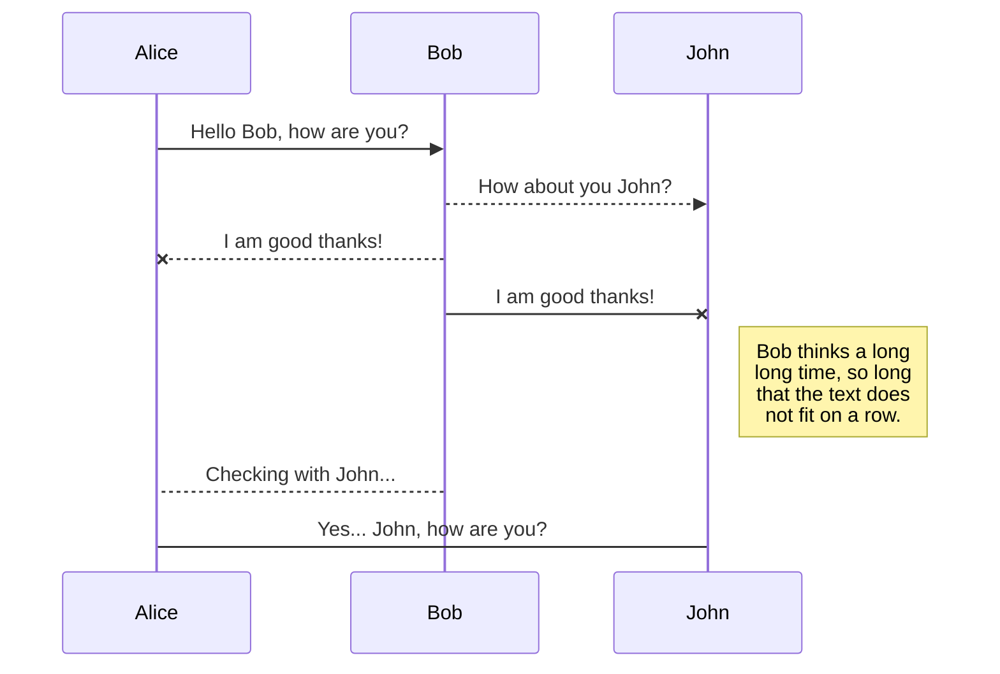
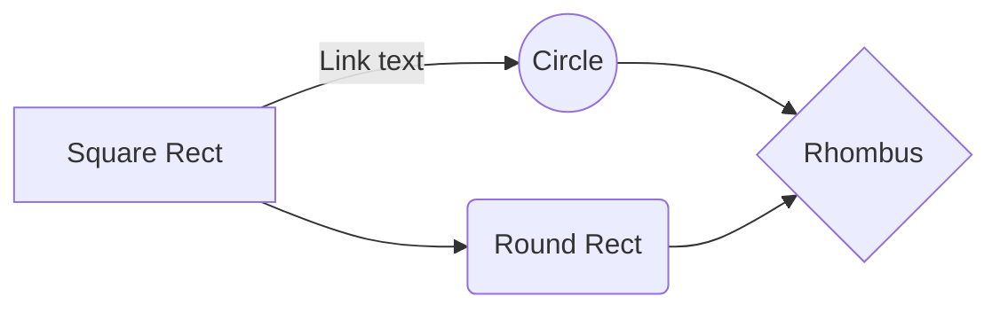

# Welcome to SpamClassifier!

Hi! We are a group of students of The University of Economics in Wrocław. We have created this project as a final project for Network Services. If you want to learn about SpamClassifier and how to use it, please continue reading.

# Table of Contents

-   [Project Structure](#project-structure)
-   [Features](#features)
-   [Installation](#installation)
-   [Usage](#usage)
-   [API Endpoints](#api-endpoints)
-   [Technologies Used](#technologies-used)
-   [Contributing](#contributing)
-   [License](#license)
-   [Acknowledgements](#acknowledgements)

# Project structure
```

	spamClassifier
	│   README.md  
	│
	└───client
	│   │
	│   └───NetworkServices
	│       │   ...
	│       └───src
	|			| ...
	│		    └───app
	│		    	| ...
	│		    	| app.component.html
	│		    	| app.component.scss
	│		    	| app.component.spec.ts
	│		    	| app.component.ts
	│   
	└───server
		|	...
	    │   server.py
	    │   trainModel.py
		└───data
		    │   spam.csv
		└───models
		    │   model.pkl
		    │   vectorizer_model.pkl
    
```


# Features

-   **Backend**:
    -   Responds to API calls on one endpoint.
    -   Uses a fine tuned model for making predictions and returning results.

-   **Frontend**:
    -   Provides a user friendly interface
    -   Interacts with the backend API.
    -   Displays the prediction results to the user in a clear, intuitional manner.

# Installation

**Frontend**
Download and Install node from https://nodejs.org
Download and Install Pip
Open command line run `npm install -g npm`
Go to "spamClassifier/client/NetworkServices"
Run in "spamClassifier/client/NetworkServices" location this command `npm install`
Run `npm run ng serve`
You should see server running:
```
** Angular Live Development Server is listening on localhost:4200, open your browser on http://localhost:4200/ **


√ Compiled successfully.

```

**Backend**
Download and Install python from https://www.python.org/downloads/
Open command line, run `curl https://bootstrap.pypa.io/get-pip.py -o get-pip.py` and add new Environment Variable. assigned to user. inside of path containing pip installation folder or simply run `python -m ensurepip --upgrade`
Go to "spamClassifier/server/"
Type:
``` 
pip install flask_cors; 
pip install scikit-learn;
py server.py;
```
If some dependencies are still not resolved, you will get errors until you solve them. Try running `pip install <dependencyName>` and afterwards try again using `py server.py;`.  Do until you see server running:
```
	 * Serving Flask app 'server'
	 * Debug mode: off                                                                                                    
	WARNING: This is a development server. Do not use it in a production deployment. Use a production WSGI server instead.
	 * Running on http://127.0.0.1:5000                                                                                   
	Press CTRL+C to quit
```


# Usage

Having both Frontend and Backend installed:
1. Open command line, go to "spamClassifier/client/NetworkServices" run `npm run ng serve`
2. Open another command line, go to "spamClassifier/server/" run `py server.py`
3. Open browser, navigate to http://localhost:4200/
4. Fill in the inputs, and press 'Spam Check'
5. Wait until you see response

# API Endpoints

The backend server consists only of one endpoint, which accepts only POST method.
By default the server can be reached locally on http://127.0.0.1:5000. Therefore the route to reach the the endpoint is http://127.0.0.1:5000/predict, as body of the request you have to provide a content variable with some string of data, just like bellow:
```
	{
		 content: <mailContent>
	}
```
As a response you will receive either this `{"content": "ham"}` or this `{"content": "spam"}`, which accordingly could be interpreted as "Your message is not a spam" and "Your message is a spam".


# Technologies Used


# Contributing


# License


## Synchronize a file


> **Note:** The **Synchronize now** button is disabled if you have no file to synchronize.

## Manage file synchronization


# Publication


# Acknowledgements


-----------------------------------------------------------------------------------------------------------------

## SmartyPants

SmartyPants converts ASCII punctuation characters into "smart" typographic punctuation HTML entities. For example:

|                |ASCII                          |HTML                         |
|----------------|-------------------------------|-----------------------------|
|Single backticks|`'Isn't this fun?'`            |'Isn't this fun?'            |
|Quotes          |`"Isn't this fun?"`            |"Isn't this fun?"            |
|Dashes          |`-- is en-dash, --- is em-dash`|-- is en-dash, --- is em-dash|


## KaTeX

You can render LaTeX mathematical expressions using [KaTeX](https://khan.github.io/KaTeX/):

The *Gamma function* satisfying $\Gamma(n) = (n-1)!\quad\forall n\in\mathbb N$ is via the Euler integral

$$
\Gamma(z) = \int_0^\infty t^{z-1}e^{-t}dt\,.
$$

> You can find more information about **LaTeX** mathematical expressions [here](http://meta.math.stackexchange.com/questions/5020/mathjax-basic-tutorial-and-quick-reference).


## UML diagrams

You can render UML diagrams using [Mermaid](https://mermaidjs.github.io/). For example, this will produce a sequence diagram:



And this will produce a flow chart:

